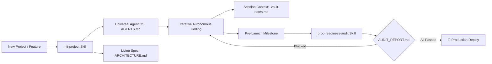

# ⚡ Production-Grade AI Agent Skills & Governance

[](LICENSE)
[](https://claude.ai/code)
[](https://deepmind.google)
[](https://cursor.com)
[](#)

A curated collection of autonomous, production-ready **Agent Skills** designed for modern AI engineering workflows. Built and battlefield-tested by [ILF Studio](https://ilf-studio.com) and [ilovefiniki.com](https://ilovefiniki.com).

These skills establish strict spec-driven engineering, automated multi-agent governance, pre-deploy security gating, and comprehensive production readiness auditing across any software project.

---

## 📦 Included Skills

| Skill | Purpose | Primary Triggers |
|---|---|---|
| [`init-project`](skills/init-project/SKILL.md) | Universal multi-agent project bootstrapper. Configures `AGENTS.md`, `ARCHITECTURE.md`, `README.md`, context scratchpads, zero-leak rules, and runtime verification. | `init project`, `setup project`, `bootstrap agent governance` |
| [`prod-readiness-audit`](skills/prod-readiness-audit/SKILL.md) | Deep pre-launch audit across 6 pillars: Security/Secrets, SEO/GEO 2026, Forms/CTA, Lighthouse CWV, Media, and Consent Compliance. Outputs `AUDIT_REPORT.md`. | `prod-readiness-audit`, `audit prod`, `preflight check` |
| [`infographic-engine`](skills/infographic-engine/SKILL.md) | Code-first HTML/CSS/SVG architecture visualizer (CAD blueprints, dynamic ROI sliders, trace replay, metric grids). | `infographic-engine`, `create diagram`, `visualize architecture` |
| [`social-screenshot-creator`](skills/social-screenshot-creator/SKILL.md) | Realistic 2x Retina screenshots for LinkedIn, Threads, and X via Playwright with neutral persona defaults. | `social-screenshot-creator`, `make screenshot post`, `create preview` |
| [`linkedin-carousel-creator`](skills/linkedin-carousel-creator/SKILL.md) | Publication-ready 1080×1350 PDF carousels for LinkedIn across dark, paper, and cream editorial themes. | `linkedin-carousel-creator`, `make carousel`, `generate slides` |
| [`youtube-summary-extractor`](skills/youtube-summary-extractor/SKILL.md) | Zero-download YouTube transcript, chapter, and executive summary extractor with rate-guard. | `youtube-summary-extractor`, `summarize video`, `get transcript` |
| [`youtube-action-planner`](skills/youtube-action-planner/SKILL.md) | Multi-video topic researcher: batch extracts transcripts from top 10 videos and synthesizes an actionable plan. | `youtube-action-planner`, `research topic`, `generate action plan` |
| [`instagram-reels-analyzer`](skills/instagram-reels-analyzer/SKILL.md) | Anonymous Reels downloader + multimodal inspector (hooks, on-screen text, pacing) with 0 account risk. | `instagram-reels-analyzer`, `analyze reel`, `inspect reel` |

---

## ⚡ 1-Liner Quick Installation

Install directly into your project's workspace:

### Install all skills:
```bash
curl -fsSL https://raw.githubusercontent.com/ilovefiniki/agent-skills/main/scripts/install.sh | bash
```

### Install a specific skill:
```bash
curl -fsSL https://raw.githubusercontent.com/ilovefiniki/agent-skills/main/scripts/install.sh | bash -s -- init-project
```

*The installer automatically places the skill definitions into `.agents/skills/` and `.claude/skills/`.*

---

## 🧠 The AI Engineering Lifecycle



---

## 🛠️ Cross-Agent Compatibility

All skills strictly adhere to the universal **Agent Skills Markdown Specification** (YAML frontmatter + operational markdown instructions) and run seamlessly across:

| Agent / IDE | Configuration Path | Status |
|---|---|---|
| **Claude Code** | `.claude/skills/<skill>/` or `.claude/commands/` | Supported |
| **Antigravity / Gemini** | `.agents/skills/<skill>/` | Supported |
| **Cursor** | `.cursor/rules/` or project root | Supported |
| **Windsurf** | `.windsurf/rules/` | Supported |
| **Hermes Agent** | Custom skill directory | Supported |

---

## 🔍 Deep Dive into Skills

### 1. `init-project`
Enforces the **Spec-Driven Governance Rule**:
- Scans target workspace (Astro, Next.js, Fastify, Express, Python, Docker).
- Differentiates between **Public Web Applications** (SEO, analytics, cookie compliance) and **Internal Tools** (auth-focused, skips public trackers).
- Enforces runtime browser verification (0 unhandled JS errors in console) before code is marked complete.
- Implements analytics isolation (`?admin=1`, `admin_ga_disabled`) to prevent testing from contaminating analytics.

### 2. `prod-readiness-audit`
A non-compromising 6-pillar preflight check:
1. **Security & Privacy:** Scans for hardcoded tokens, checks honeypots on all forms, and verifies security headers.
2. **SEO & GEO 2026:** AI search crawler optimization (`/llms.txt`, `/robots.txt`), schema markup, BLUF structuring, and hreflang validation.
3. **Forms & Contacts:** End-to-end dry-run submission testing and placeholder fact-checking (no fake numbers or dead CTA buttons).
4. **PageSpeed & CWV:** Real-world Core Web Vitals checks (LCP < 2.5s, CLS < 0.1, INP < 200ms).
5. **Media Optimization:** WebP/AVIF formats, dimensions, and LCP fetchpriority gating.
6. **Cookie & Analytics Compliance:** Verifies tracking remains paused prior to consent.

---

## 🤝 Contributing

Contributions of new production-grade skills and improvements are welcome! Please open an issue or pull request.

## 📄 License

Released under the [MIT License](LICENSE). Maintained by [Vitaliy Alhimovich](https://github.com/ilovefiniki) at [ILF Studio](https://ilf-studio.com).
